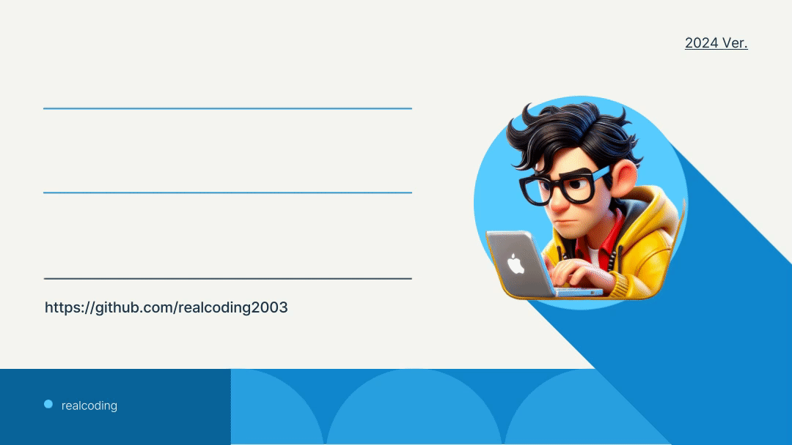

  

<picture>
  <source
    srcset="https://github-readme-stats.vercel.app/api/top-langs/?username=realcoding2003&size_weight=0.5&count_weight=0.5&theme=dark"
    media="(prefers-color-scheme: dark)"
  />
  <source
    srcset="https://github-readme-stats.vercel.app/api/top-langs/?username=realcoding2003&size_weight=0.5&count_weight=0.5"
    media="(prefers-color-scheme: light), (prefers-color-scheme: no-preference)"
  />
  
</picture>

<picture>
  <source
    srcset="https://github-readme-stats.vercel.app/api?username=realcoding2003&show_icons=true&theme=dark"
    media="(prefers-color-scheme: dark)"
  />
  <source
    srcset="https://github-readme-stats.vercel.app/api?username=realcoding2003&show_icons=true"
    media="(prefers-color-scheme: light), (prefers-color-scheme: no-preference)"
  />
  
</picture>

<!--
**realcoding2003/realcoding2003** is a ✨ _special_ ✨ repository because its `README.md` (this file) appears on your GitHub profile.

Here are some ideas to get you started:

- 🔭 I’m currently working on ...
- 🌱 I’m currently learning ...
- 👯 I’m looking to collaborate on ...
- 🤔 I’m looking for help with ...
- 💬 Ask me about ...
- 📫 How to reach me: ...
- 😄 Pronouns: ...
- ⚡ Fun fact: ...
-->
